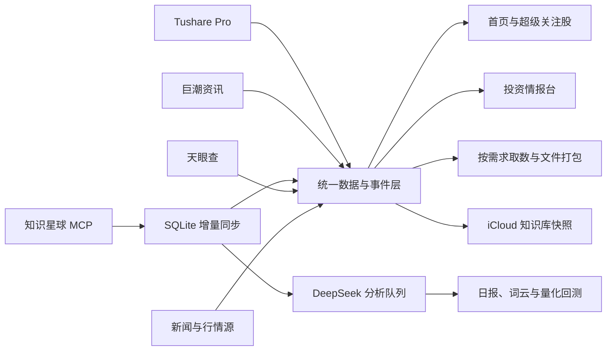

# 乐子乌超级价值

乐子乌超级价值是一套面向个人投资研究的财经数据、情报监控与证据分析平台，可在本机运行，也可部署到云服务器供多用户访问。

它把 Tushare Pro、巨潮资讯、知识星球 MCP、天眼查、新闻与行情源接入同一套数据体系，围绕自选股持续完成数据同步、事实归档、跨渠道检索、模型分析、事件研究和文件交付。平台当前重点关注：

- 华懋科技（`603306.SH`）
- 胜宏科技（`300476.SZ`）

系统使用 SQLite 保存结构化数据；账号凭据、API Token、运行数据库、缓存和日志不会进入 Git 仓库。生产环境通过容器资源限制、持续健康检查与增量 worker 保持网页服务和数据更新相互隔离。

> 本项目用于信息整理与研究辅助，不构成投资建议，也不会自动下单。

## 核心能力

| 模块 | 解决的问题 |
| --- | --- |
| 首页市场大看板 | 汇总 A 股、海外指数、市场温度、资金状态和自选股核心变化 |
| 超级关注股 | 为每只自选股聚合近半年行情、财务、估值、资金、公告、研报、企业信息与小作文 |
| 投资情报台 | 将公告、新闻、研报、机构调研、公司事件和观点按渠道分流展示 |
| 机构段子与录音 | 从知识星球 MCP 增量同步原文与录音，提供检索获取、按需录音转写与 AI 纪要、实时队列分析、日报、词云和个股提及跟踪 |
| 量化回测与数据利用 | 研究券商团队胜率、首次提及、吹票强度、事件后收益、趋势信号和组合表现 |
| 数据一站式获取 | 用自然语言生成可审计取数计划，按渠道分别调用接口并打包 JSON、CSV、Excel、ZIP |
| 巨潮公告中心 | 按股票、日期、公告类型和关键词重新检索，导出索引并按需打包 PDF/TXT |
| iCloud 知识库 | 把本地知识数据库发布为带校验信息的不可变 SQLite 快照，用于备份与跨设备查阅 |

## 数据链路



平台保留来源、原始接口、事件时间、入库时间、证券代码、结构化字段和原文链接。不同信息不会被混成一个不可追溯的结论：

- `official`：上市公司和监管披露，例如巨潮公告。
- `licensed`：Tushare、天眼查等授权接口返回的结构化数据。
- `reported`：财经媒体和券商公开发布记录。
- `unverified`：知识星球、小作文和外部投稿等待核验观点。

模型生成的情绪、重要度、机会分和风险分只用于排序与研究，不会标记为客观事实。

## 数据源

### Tushare Pro

统一财经数据接口支持按 `api_name` 调用当前 Token 有权限的数据。投资情报台已经结构化使用以下数据域：

- 行情与估值：`daily`、`daily_basic`、指数日线。
- 财务与业绩：`fina_indicator`、`income`、`balancesheet`、`cashflow`、`forecast`。
- 资金与筹码：`moneyflow`、`cyq_perf`、`cyq_chips`、`margin_detail`、`hk_hold`。
- 交易异动：龙虎榜、机构席位、大宗交易、涨跌停、停复牌和券商金股。
- 股权与治理：质押、解禁、增减持、回购、股东、高管、分红和审计。
- 机构与研报：盈利预测、机构调研、完整研报与研报附件链接。
- 财经资讯：财联社、新浪财经、华尔街见闻、同花顺、东方财富、第一财经等。

接口是否返回数据，以当前 Tushare Token 的实际权限为准。系统不会用模拟结果填补无权限接口。

### 巨潮资讯

公告任务会直接调用巨潮同源公开接口重新检索，而不是用本地旧记录假装实时结果。后台默认只检查自选股近期公告，支持 26 类公告筛选、Excel 索引导出以及用户明确选择后的 PDF/TXT/ZIP 打包。

自动轮询不会批量下载公告文件。只有用户明确要求文件时，系统才下载所选公告 PDF，并限制来源域名、文件大小和单次打包数量。

### 知识星球 MCP

知识星球登录态由 MCP 持有，本项目不保存 Cookie，也不绕过 MCP 直接抓取。常驻 worker 按主题时间游标增量同步到 SQLite，并按 `topic_id` 幂等处理：

```text
知识星球 MCP → 增量游标 → SQLite → DeepSeek 队列 → 雷达/日报/情报台/回测
```

正文新增或发生变化时才重新分析；点赞数等低价值统计变化不会触发重复处理。图片与附件默认只保存元数据，用户点击“查看”时才向 MCP 申请新的临时链接，不自动下载到本地。

“机构段子与录音”还可后台回填近 1 年或近 2 年历史纪要。历史内容默认只入库供检索、首次提及研究和量化回测，不自动消耗 AI 额度；用户明确点击“按需 AI 分析”后才进入模型队列。未分析历史中含有明确证券代码的原文，可用确定性关键词方向作为基础回测事件，并始终标记为 `raw_unanalyzed`。

### 天眼查

天眼查通过本机已登录的官方 `tyc` CLI 查询。系统先把股票简称锚定为企业登记全称，再按维度获取工商登记、股东与实控人、投资关系、高管、司法与行政风险、经营信息、知识产权、招投标、供应商客户、产品和历史变更等企业事实。

### 其他来源

统一事件接口允许继续接入新的知识星球、合作 API、Webhook 或 MCP。每条外部事件使用 `source_key + external_id` 幂等去重，凭据只能通过环境变量或服务端密钥管理提供。

## 主要页面

### 首页市场大看板

首页提供 A 股指数、海外市场、涨跌分布、涨跌停数量、北向资金、自选股摘要和少量高价值情报。普通访问使用五分钟缓存，手动刷新才强制重新聚合，避免每分钟重复请求自选股数据。

### 概念题材查看

`/concept-themes` 汇总同花顺、东方财富、开盘啦、通达信与申万口径，按题材家族、产业链簇、原始来源题材和成分股逐层浏览。个股题材权重综合来源共识、业务证据、市场热度与专属性；20/60/120 日归因使用剔除自身后的题材组合并控制沪深300，分别呈现题材 Beta、窗口 Alpha、R²、置信等级及可回到原文核验的公司独特证据。完整方法见 [概念题材共识引擎](docs/concept-theme-consensus.md)。

### 超级关注股

`/super-watchlist` 是独立页面。新增自选股后，系统会建立持久化的 183 天历史回填任务，分别补充：

- Tushare 行情、估值、财务、资金、筹码、研报和新闻；
- 巨潮上市公司公告；
- 知识星球相关调研纪要；
- 天眼查企业事实。

单个渠道失败不会阻断其他渠道，失败任务可针对单只股票重跑。页面默认显示结论和关键变化，完整内容进入可筛选的事实流水。

### 投资情报台

信息按公司公告、财经快讯、券商研报、机构调研、资金席位、股权事项、财务业绩、企业风险、知识星球和公开股评分流。东方财富股吧公开帖子按自选股增量保存真实作者、时间、正文摘录、互动数和原文链接，统一标为待核验，并与千股千评/雪球热度指标分开。行情不混入消息流，只在开盘和收盘固化有意义的状态快照。“数据源 BI”单独列出全部渠道的存量、最新时间、上轮抓取量、增量、耗时、频率、底层接口和直接调用入口。

点击事件可查看原文、原始链接、来源接口、证据等级和结构化指标。无法追溯原文的内容会明确标记。

### 机构段子与录音

雷达提供：

- 新增纪要实时分析队列和失败重试；
- 近 30 天标签、情绪、股票热度和高信息增量内容；
- 个股日、周、月提及词云及前周期变化；
- 每个配置模型独立生成的前一日小作文日报；
- 多模型共识、分歧、证据覆盖率和低置信内容；
- 华懋科技、胜宏科技的最新论点、催化剂与风险。

### 量化回测与数据利用

小作文事件研究默认使用事件后首个交易日开盘价作为买入价，并观察第 5、10、20 个交易日收盘收益。系统可按自定义券商研究组规则统计成熟样本胜率、超额收益、首次提及、吹票强度和趋势信号，再以排名靠前的成熟研究组构建研究组合。

回测结果不包含真实交易中的涨跌停成交约束、滑点、手续费和容量，不能直接等同于可实现收益。

### 数据一站式获取

用户输入自然语言需求后，DeepSeek 先生成可审计计划；页面会逐项展示渠道、接口、参数、日期范围和用途。确认后，每个渠道独立取数和记录状态，不会把全部数据源无差别塞进结果包。

ZIP 按渠道分目录，包含数据文件、Excel 工作簿、`manifest.json` 和说明文档。只有需求中明确出现“文件、附件、PDF、原文”等要求时，才下载允许获取的附件。

## 快速开始

### 环境要求

- Python 3.10 或更高版本
- Node.js `20.19+` 与 npm `10+`
- macOS、Linux 或 Windows；后台自启动与 Dock 应用入口仅支持 macOS
- 至少一个可用的大模型配置
- 按需配置 Tushare、知识星球 MCP、天眼查和新闻接口

### 安装

```bash
git clone git@github.com:wu427692-alt/financial-intelligence-platform.git
cd financial-intelligence-platform

python3 -m venv .venv
source .venv/bin/activate
pip install -r requirements.txt

cp .env.example .env
```

编辑 `.env`，至少设置自选股、模型和所需数据源。不要把真实密钥写入 `.env.example` 或提交到 Git。

### 构建前端

```bash
cd apps/dsa-web
npm install
npm run build
cd ../..
```

生产构建会写入根目录 `static/`，由 FastAPI 统一提供页面与接口。

### 启动

只启动本地 Web 与 API：

```bash
source .venv/bin/activate
python main.py --serve-only --host 127.0.0.1 --port 8000
```

打开：

- Web：`http://127.0.0.1:8000`
- OpenAPI：`http://127.0.0.1:8000/docs`
- 健康检查：`http://127.0.0.1:8000/api/health`

运行一次股票分析并同时启动服务：

```bash
python main.py --serve --stocks 603306,300476
```

## 最小配置示例

```dotenv
STOCK_LIST=603306,300476
TUSHARE_TOKEN=your_tushare_token

DEEPSEEK_API_KEY=your_deepseek_api_key

WEBUI_ENABLED=true
WEBUI_HOST=127.0.0.1
WEBUI_PORT=8000
ADMIN_AUTH_ENABLED=true

DATABASE_PATH=./data/stock_analysis.db

ZSXQ_MCP_AUTO_START=true
ZSXQ_MCP_POLL_SEC=10
ZSXQ_MCP_GROUPS=28855458518111:调研纪要

ESSAY_ANALYSIS_AUTO_START=true
ESSAY_ANALYSIS_MODEL=deepseek-v4-flash
ESSAY_ANALYSIS_CONCURRENCY=50
ESSAY_ANALYSIS_BACKFILL_DAYS=30
ESSAY_WATCHLIST=603306.SH:华懋科技,300476.SZ:胜宏科技

INVESTMENT_MONITOR_AUTO_START=true
INVESTMENT_MONITOR_POLL_SEC=10
CNINFO_WATCHLIST_AUTO_START=true
CNINFO_WATCHLIST_POLL_SEC=60
CNINFO_WATCHLIST_HISTORY_DAYS=365
```

`ZSXQ_MCP_URL` 属于敏感配置，优先由部署环境注入。本机未配置时，服务可读取 Codex 中已经配置的知识星球 MCP 地址。

## macOS 后台运行与应用入口

完成依赖安装、`.env` 配置和前端构建后运行：

```bash
bash scripts/install-macos-autostart.sh
```

安装器会：

- 使用 LaunchAgent 在登录后启动后台服务；
- 安装“财经情报台.app”并加入 Dock；
- 让应用双击后等待服务就绪并打开本地页面；
- 将运行副本放入 `~/Library/Application Support/财经情报台/runtime`；
- 保留项目目录与运行环境共用的 `.env` 和 `data/`。

卸载自启动：

```bash
bash scripts/uninstall-macos-autostart.sh
```

详细说明见 [macOS 登录自启动与应用入口](docs/macos-autostart.md)。

## iCloud 知识库

iCloud 功能不会把正在写入的 SQLite 数据库直接放入 iCloud Drive，而是定时发布只读、一致、可校验的知识库快照：

```dotenv
ICLOUD_KNOWLEDGE_AUTO_START=true
ICLOUD_KNOWLEDGE_SYNC_INTERVAL_MINUTES=15
ICLOUD_KNOWLEDGE_RETENTION=12
```

每个版本包含独立 SQLite 文件、JSON 清单、SHA-256、表记录数和设备标识。快照不包含 API 密钥、账号、对话、LLM 用量或持仓交易。当前定位是备份、灾备和跨设备查阅，不支持多设备同时写入。

## 主要 API

所有业务接口统一位于 `/api/v1`：

| 接口 | 用途 |
| --- | --- |
| `GET /home-dashboard` | 首页市场与自选股大看板 |
| `GET /investment-monitor/intelligence-dashboard` | 投资情报决策看板 |
| `GET /investment-monitor/source-bi` | 全渠道数据源资产、时效和调用能力 BI |
| `GET /investment-monitor/super-watchlist` | 超级关注股全景 |
| `GET /investment-monitor/events` | 分渠道筛选事实和观点 |
| `POST /investment-monitor/sync` | 立即同步指定数据源 |
| `POST /investment-monitor/announcements/sync` | 重新检索巨潮公告 |
| `POST /financial-data/tushare/{api_name}` | 调用 Tushare 数据资源 |
| `POST /financial-data/zsxq/sync` | 立即执行知识星球 MCP 增量同步 |
| `GET /essay-radar/dashboard` | 小作文分析看板 |
| `GET /essay-radar/word-cloud` | 日、周、月词云 |
| `POST /essay-quant/run` | 运行小作文事件研究与组合回测 |
| `GET /essay-quant/research-catalog` | 读取量化研究方法与真实本地数据资产 |
| `GET /essay-quant/runs` | 读取可复现量化运行历史 |
| `POST /essay-quant/natural-language/plan` | 生成受约束自然语言研究方案与模板代码 |
| `POST /essay-quant/natural-language/execute` | 确认并执行已校验的量化任务 |
| `POST /data-acquisition/plan` | 生成自然语言取数计划 |
| `POST /data-acquisition/run` | 执行计划并生成数据包 |

完整字段、请求示例和数据边界请查看交互式 OpenAPI `/docs`。

## 测试

后端：

```bash
source .venv/bin/activate
python -m pytest
```

前端：

```bash
cd apps/dsa-web
npm run lint
npm run test
npm run build
```

涉及第三方接口的测试可能需要单独的 Token、登录态或网络环境。离线单元测试不应依赖真实密钥。

## 数据与安全

- `.env`、SQLite、日志、报告、下载文件和本地运行目录已加入忽略规则。
- API 凭据只从环境变量或本机认证状态读取。
- 前台可启用多用户访问：用户只需姓名和密码提交申请，管理员在 `/admin/access` 审批；批准后可通过可信 IP 自动进入，换网时仍可密码登录。
- 自选股、问股会话、分析历史与任务、持仓账户、告警规则、AI 建议信号、量化规则/运行记录和传统回测按账号隔离；行情、公告、研报和小作文等事实库由后台共享更新，浏览器不会获得第三方 API 密钥。
- 管理后台入口为 `/admin`，用户审批、API 与模型、数据源、同步控制、用量审计和系统设置均要求独立管理员会话。
- 知识星球图片和附件默认不落盘，只在用户点击时获取临时链接。
- 巨潮附件只允许可信 PDF 域名，并设置文件大小与打包数量限制。
- 单个数据源故障不会中断其他渠道，页面会显示来源健康状态和降级原因。
- 对外开放 WebUI 前必须启用 `ADMIN_AUTH_ENABLED=true` 保护管理控制面，并通过可信反向代理配置 HTTPS。

## 文档

- [文档中心](docs/INDEX.md)
- [统一财经数据 API](docs/financial-data-api.md)
- [数据一站式获取](docs/data-acquisition.md)
- [投资情报台](docs/investment-monitor.md)
- [小作文量化回测](docs/essay-quant.md)
- [首页市场大看板](docs/home-dashboard.md)
- [完整配置与部署指南](docs/full-guide.md)

## 当前边界

- 外部接口的实时性、完整性和可用性取决于数据商权限、网络和上游服务。
- 知识星球观点属于研究线索，不代表信息已经被上市公司或监管披露证实。
- 图片 OCR、iCloud 多设备双向写入和真实交易执行不在当前范围内。
- 回测不能消除幸存者偏差、样本选择偏差、未来函数风险和市场冲击。

## License

本项目沿用仓库中的 [MIT License](LICENSE)。第三方数据、内容与接口仍受各自服务条款和授权范围约束。
