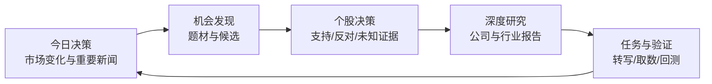
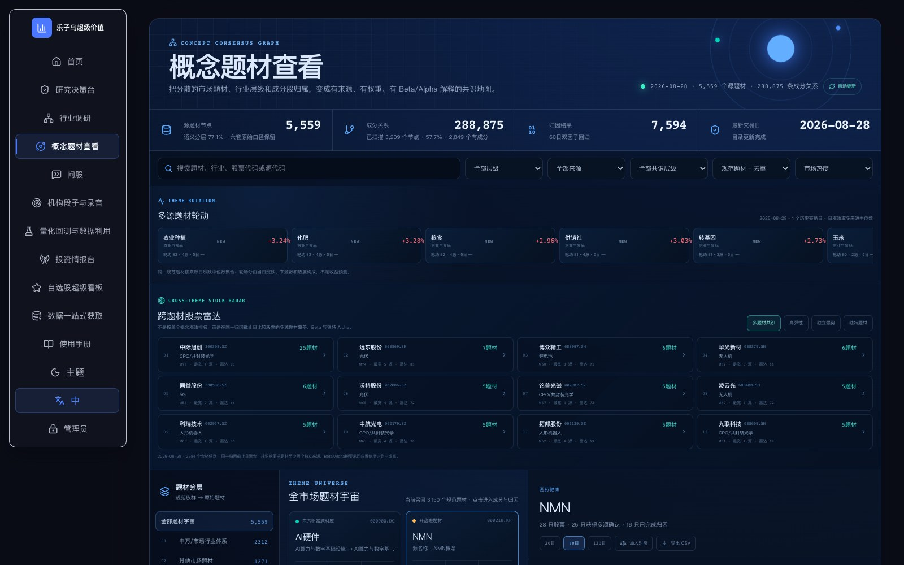
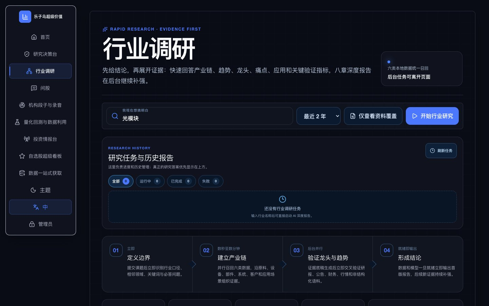
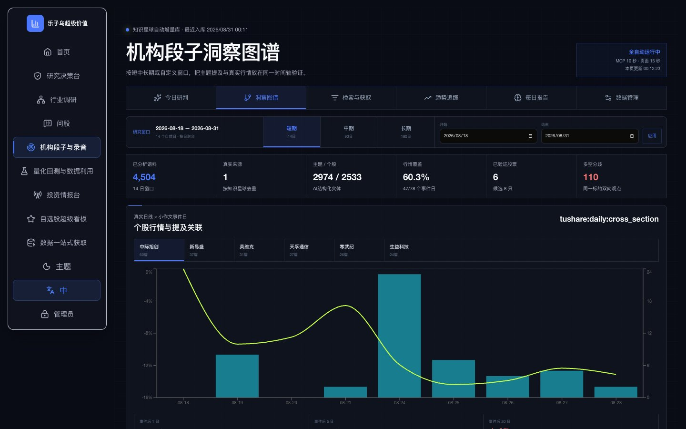
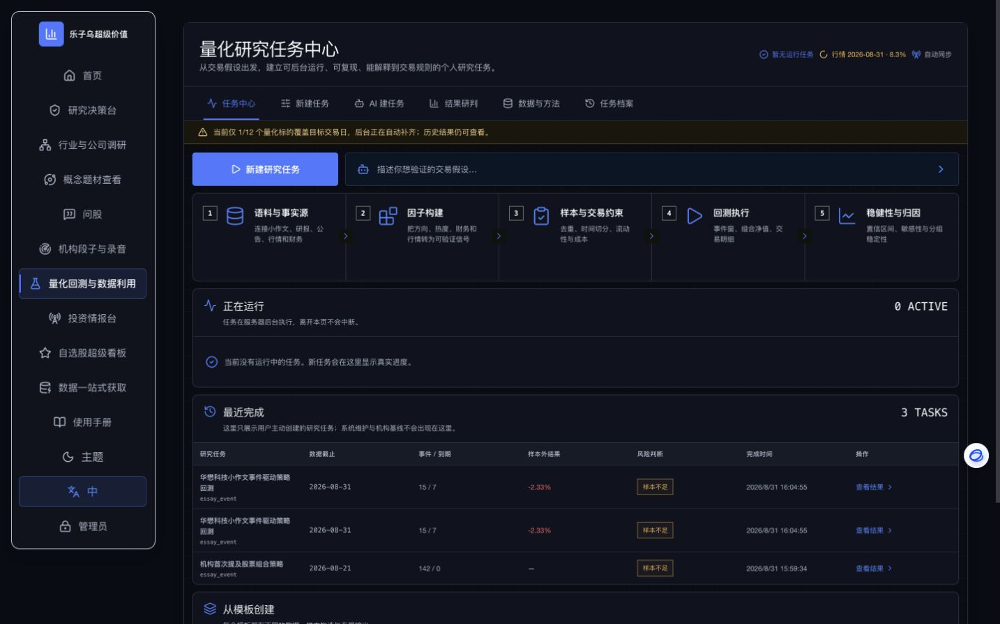
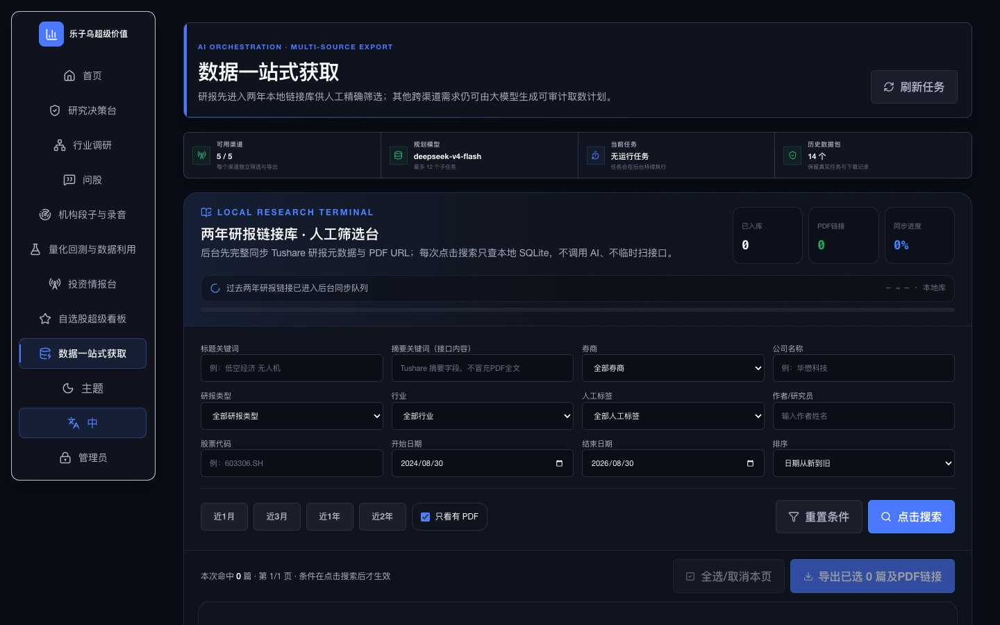
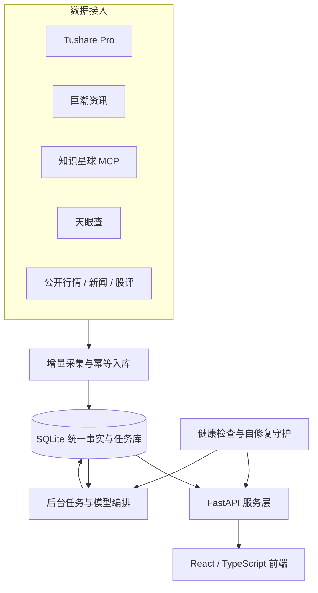

<p align="center">
  
</p>

<h1 align="center">乐子乌超级价值</h1>

<p align="center">
  <strong>从市场变化，到证据判断，再到研究、验证与行动。</strong><br />
  面向个人投资者的多源财经数据与 AI 研究平台。
</p>

<p align="center">
  <a href="https://app.leziwu.com"><strong>在线体验</strong></a>
  · <a href="https://app.leziwu.com/guide">使用手册</a>
  · <a href="docs/INDEX.md">开发文档</a>
  · <a href="https://github.com/wu427692-alt/leizuw-super-analyst/issues">提交问题</a>
</p>

<p align="center">
  <a href="https://github.com/wu427692-alt/leizuw-super-analyst/actions/workflows/ci.yml"></a>
  
  
  
  
  
  <a href="LICENSE"></a>
</p>

> 生产站点首页与产品介绍可直接访问；研究工作区采用注册申请与管理员审批。项目用于信息整理、研究辅助与策略验证，不构成投资建议，也不会自动替用户下单。

## 一条完整的投资研究闭环

乐子乌超级价值不是把接口堆在同一个页面，而是围绕一次真实决策组织数据和工具：



| 工作区 | 回答的问题 | 主要输出 |
| --- | --- | --- |
| 今日决策 | 今天发生了什么，哪些变化值得处理？ | 市场环境、重要新闻、自选股变化与今日待办 |
| 机会发现 | 哪些题材和标的值得继续研究？ | 分层题材、成分股、题材权重、Beta / Alpha 与证据入口 |
| 个股决策 | 这只股票为什么值得买、等待或回避？ | 实时行情、事实时间线、支持/反对证据、情景与行动条件 |
| 深度研究 | 关键问题还缺什么证据？ | 公司或行业深度报告、图表、证据清单、Word / PDF |
| 任务与验证 | 研究能否在后台完成并被复现？ | 任务进度、录音转写、数据包、量化结果与研究档案 |

## 当前产品实机

下面均为当前程序的真实界面，而非概念稿。

### 今日决策 · 先确定市场环境

<p align="center">
  
</p>

指数、市场广度、行业涨跌、自选股行情和重要新闻使用各自明确的交易日、来源与更新时间，不用旧收盘数据冒充实时行情。

### 机会发现 · 从题材共识走向候选

<p align="center">
  
</p>

把同花顺、东方财富、开盘啦、通达信、申万与机构语料映射到统一题材层级；再用来源共识、业务证据、市场联动和专属性解释题材 Beta 与个股 Alpha。

### 深度研究 · 公司与行业研究任务

<p align="center">
  
</p>

公司和行业均可发起后台研究。系统组织公告财报、研报、机构段子、录音转写、行情与互联网资料，形成可追溯的标准研究报告。

<table>
  <tr>
    <td width="50%" valign="top">
      <strong>机构段子与录音</strong><br /><br />
      
      <br />增量入库、全文检索、录音转写、AI 纪要、趋势洞察与原文证据。
    </td>
    <td width="50%" valign="top">
      <strong>量化研究任务中心</strong><br /><br />
      
      <br />研究任务后台运行，保存数据截止时间、参数、样本、结果与稳健性解释。
    </td>
  </tr>
  <tr>
    <td colspan="2" valign="top">
      <strong>数据一站式获取</strong><br /><br />
      
      <br />研报先进入本地两年链接库，再按标题、摘要、券商、公司、行业、作者、日期与 PDF 状态精细筛选；其他复杂需求生成可审计取数计划，按渠道分别执行与打包。
    </td>
  </tr>
</table>

## 数据与证据如何打通

| 数据源 | 已使用的数据 | 在平台中的用途 |
| --- | --- | --- |
| Tushare Pro | 行情、财务、估值、资金、筹码、龙虎榜、研报、新闻 | 市场、个股、题材、量化与取数 |
| 巨潮资讯 | 公司公告、历史公告与 PDF 原文 | 自选股证据、深度研究、公告检索 |
| 知识星球 MCP | 机构段子、图片、文件与录音 | 增量语料库、原文检索、录音转写、事件研究 |
| 天眼查 | 工商、股权、风险、知识产权与经营事实 | 公司画像与风险核验 |
| 公开行情与股评 | 腾讯/新浪行情、东方财富公开讨论等 | 分钟行情、市场广度、投资者观点线索 |
| 本地 SQLite | 统一证券、时间、来源、原文与任务索引 | 跨页面共享、低延迟查询、审计与复现 |

平台对事实与观点分层保存：

- **官方披露**：公告、财报和监管信息；
- **授权数据**：Tushare、天眼查等接口返回；
- **公开报道**：财经媒体和券商公开内容；
- **待核验线索**：机构段子、录音观点与公开股评；
- **模型产物**：摘要、标签、情景和研究报告，始终保留来源和证据入口。

AI 负责提取、归纳、转写后研判、研究编排和自然语言任务生成，不会把无法追溯的模型结论伪装成事实。

## 技术架构



- 前后台分离：页面请求与增量采集互不阻塞；
- 数据共享：行情、公告、研报、语料和任务不在不同页面重复建库；
- 增量优先：按游标和稳定 ID 入库，已存在数据不重复处理；
- 多用户隔离：自选股、问股、量化和研究任务按账号保存；
- 可观测与恢复：健康检查、任务账本、错误重试与服务守护保留现场；
- 密钥隔离：浏览器不接触第三方 Token，仓库不包含生产密钥或运行数据库。

## 快速开始

### 1. 环境

- Python 3.10+
- Node.js 20.19+
- npm 10+
- macOS / Linux / Windows

### 2. 安装

```bash
git clone https://github.com/wu427692-alt/leizuw-super-analyst.git
cd leizuw-super-analyst

python3 -m venv .venv
source .venv/bin/activate
pip install -r requirements.txt
cp .env.example .env
```

在 `.env` 中配置需要使用的模型和数据源。真实密钥只能保存在本地或服务器环境中，不要提交到 Git。

### 3. 构建前端

```bash
cd apps/dsa-web
npm install
npm run build
cd ../..
```

### 4. 启动

```bash
source .venv/bin/activate
python main.py --serve-only --host 127.0.0.1 --port 8000
```

启动后访问：

- 产品首页：`http://127.0.0.1:8000`
- API 文档：`http://127.0.0.1:8000/docs`
- 健康检查：`http://127.0.0.1:8000/health`

更完整的环境变量、Docker、macOS 自启动和云服务器部署说明见 [文档中心](docs/INDEX.md)。

## 仓库结构

```text
apps/dsa-web/       React / TypeScript Web 产品
apps/dsa-desktop/   桌面端外壳与安装包
api/                FastAPI 路由、鉴权与接口层
src/                分析、任务、存储和数据服务
data_provider/      行情与财经数据适配器
scripts/            部署、同步、运维与验收脚本
tests/              后端与集成测试
docs/               产品、数据、部署和开发文档
docker/             容器与反向代理配置
```

运行数据库、附件、日志、导出文件、缓存、模型密钥和用户数据均不进入 GitHub 仓库。

## 文档与共建

- [文档中心](docs/INDEX.md)
- [使用手册（在线）](https://app.leziwu.com/guide)
- [行业与公司调研](docs/industry-research.md)
- [概念题材共识引擎](docs/concept-theme-consensus.md)
- [机构语料量化研究](docs/essay-quant.md)
- [数据一站式获取](docs/data-acquisition.md)
- [统一财经数据 API](docs/financial-data-api.md)
- [云端运维](docs/cloud-operations.md)
- [贡献指南](docs/CONTRIBUTING.md)

欢迎通过 [Issues](https://github.com/wu427692-alt/leizuw-super-analyst/issues) 提交问题、数据源建议、研究方法和改进方案。提交代码前请先阅读贡献指南，并确保不包含 API 密钥、账号、数据库或受授权限制的原始内容。

## License

本项目遵循 [MIT License](LICENSE)。上游开源代码保留原作者版权声明；本项目新增和改造部分由 `wu427692-alt` 维护。第三方数据、内容与接口仍受各自服务条款和授权范围约束。
