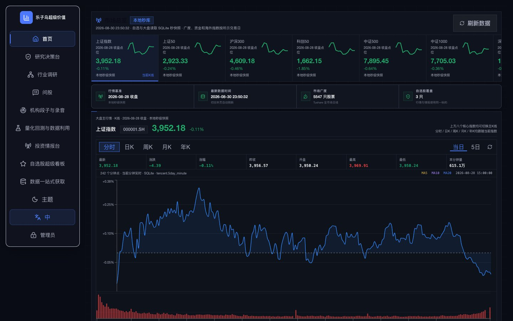

# 樂子烏超級價值

**從市場變化、證據判斷，到研究、驗證與行動的投資研究工作台。**

[線上產品](https://app.leziwu.com) · [簡體中文首頁](../README.md) · [文檔中心](INDEX.md) · [問題回報](https://github.com/wu427692-alt/leizuw-super-analyst/issues)



樂子烏把行情、財務、公告、研報、機構段子、錄音轉寫、企業事實、新聞與公開股評接入共享證據庫，並依照一次真實決策組織產品：

1. **今日決策**：先確認市場環境與重要變化；
2. **機會發現**：從題材、事件與市場共識形成候選；
3. **個股決策**：分開支持、反對與仍未知的證據；
4. **深度研究**：建立可追溯的公司或行業報告；
5. **任務與驗證**：在後台完成錄音轉寫、資料打包與量化研究。

## 主要資料來源

- Tushare Pro：行情、財務、估值、資金、研報、新聞與交易事件；
- 巨潮資訊：上市公司公告與 PDF 原文；
- 知識星球 MCP：機構段子、圖片、文件與錄音；
- 天眼查：工商、股權、風險、智慧財產權與經營事實；
- 公開來源：分時行情、財經新聞與投資者討論；
- SQLite：跨頁面共享的本地證據與任務索引。

## 快速開始

```bash
git clone https://github.com/wu427692-alt/leizuw-super-analyst.git
cd leizuw-super-analyst
python3 -m venv .venv
source .venv/bin/activate
pip install -r requirements.txt
cp .env.example .env

cd apps/dsa-web
npm install
npm run build
cd ../..
python main.py --serve-only --host 127.0.0.1 --port 8000
```

開啟 `http://127.0.0.1:8000`。生產密鑰、資料庫、日誌、附件與匯出內容都不會進入 GitHub 倉庫。

本專案只用於資訊整理、研究輔助與策略驗證，不構成投資建議，也不會代替使用者下單。

## License

[MIT](../LICENSE)。保留上游開源程式的原始版權聲明；樂子烏新增與改造部分由 `wu427692-alt` 維護。
